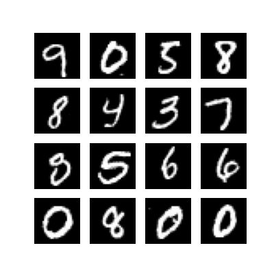

# PyTorch Implementation of DDPM on MNIST Dataset

This project is a PyTorch implementation of **Denoising Diffusion Probabilistic Models (DDPM)**. It trains on the raw MNIST dataset to generate high-quality handwritten digit images from pure Gaussian noise.

---

## 1. Core Principles

### Forward Diffusion Process
In the forward process, we gradually add Gaussian noise to the original image according to a predefined linear Beta schedule ($T=1000$) until the image becomes pure noise.

**Mathematical Formula:**

$$ q(x_t | x_0) = \mathcal{N}(x_t; \sqrt{\bar{\alpha}_t}x_0, (1 - \bar{\alpha}_t)\mathbf{I}) $$

### Backward Denoising Process
The neural network (U-Net) learns to predict the noise added at each timestep $t$. By starting from pure noise and iteratively removing the predicted noise, the model generates images "from nothing".

**Sampling Formula:**

$$ x_{t-1} = \frac{1}{\sqrt{\alpha_t}} \left( x_t - \frac{1 - \alpha_t}{\sqrt{1 - \bar{\alpha}_t}} \epsilon_\theta(x_t, t) \right) + \sigma_t z $$

---

## 2. Model Architecture

This project employs an improved **U-Net** architecture with the following core components:

*   **Sinusoidal Position Embeddings**: Encodes the scalar timestep $t$ into high-dimensional vectors (256-dim) to make the model aware of the current noise level.
*   **ResNet Blocks**: Combines GroupNorm and SiLU activation with residual connections to stabilize deep network training.
*   **Self-Attention**: Introduces attention mechanisms at low-resolution feature maps (7x7) to capture global structures of digits.
*   **Skip Connections**: Concatenates encoder and decoder feature maps to preserve fine-grained spatial details.

---

## 3. Tensor Dimensions

Example with **Batch Size = 128**:

1.  **Input Image**: `[128, 1, 28, 28]`
2.  **Time Embedding**: `[128, 256]`
3.  **U-Net Bottleneck**: `[128, 256, 7, 7]`
4.  **Output Noise Prediction**: `[128, 1, 28, 28]`

---

## 4. Results

After 50 epochs of training, the model generates clear and diverse digits:



---

## 5. Quick Start

### Data Preparation
Ensure your dataset is stored in the `archive/` directory:
- `archive/train-images.idx3-ubyte`
- `archive/train-labels.idx1-ubyte`

### Run Training
```bash
python ddpm_mnist.py
```

### Requirements
- torch
- numpy
- tqdm
- matplotlib
